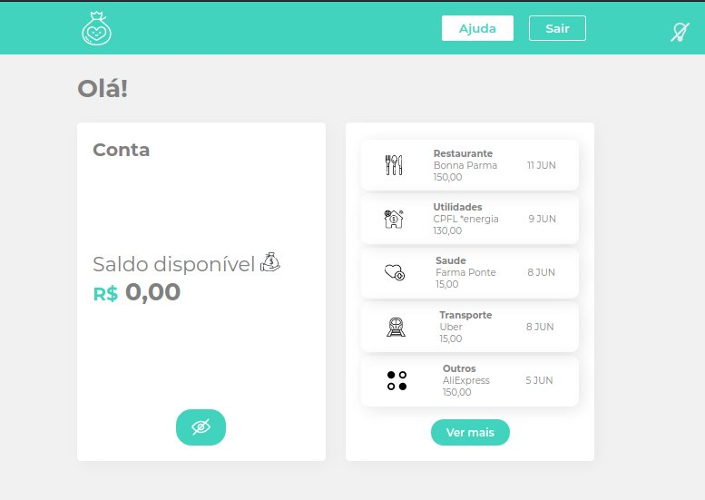
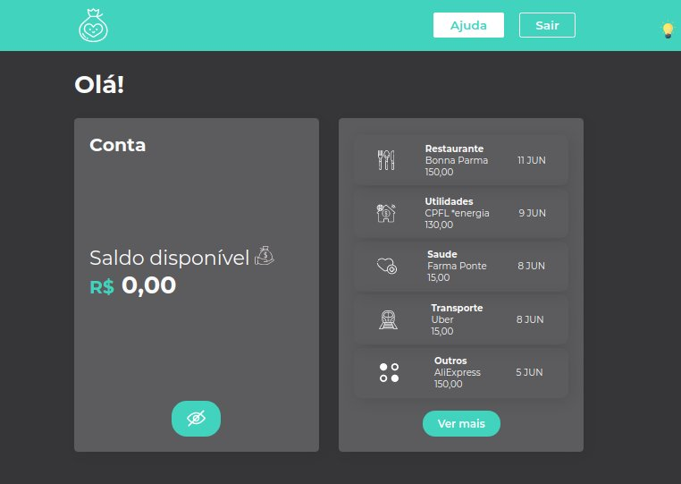

### 💻 smart-bank

Neste projeto foi abordado os conceitos de componentização da aplicação utilizado styled-components para refatorar o CSS e adicionar a funcionalidade de troca de temas, de claro para escuro, e um componente de status para visualização da movimentação de conta.

  
     

### :memo: Licença

Esse projeto está sob a licença MIT. Veja o arquivo [LICENSE](LICENSE) para mais detalhes.
